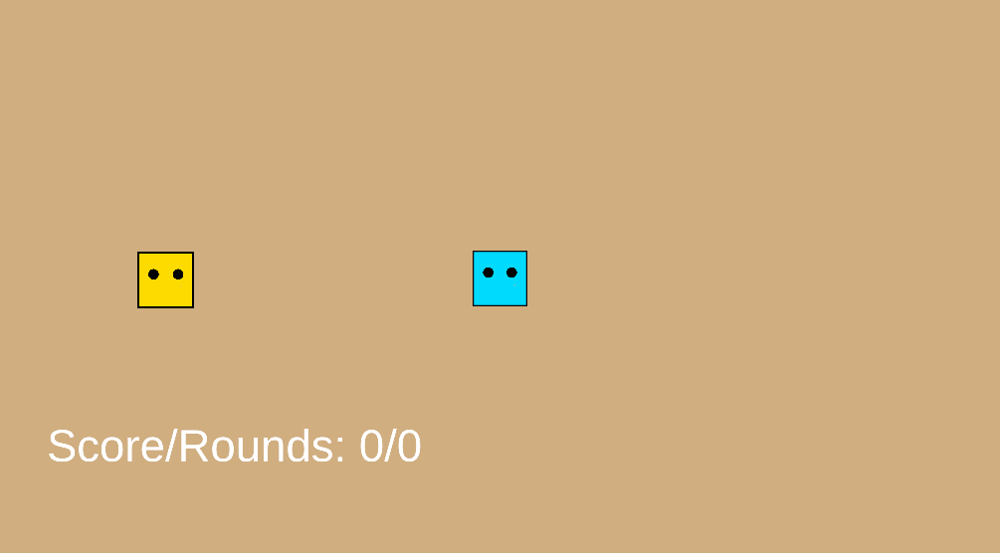
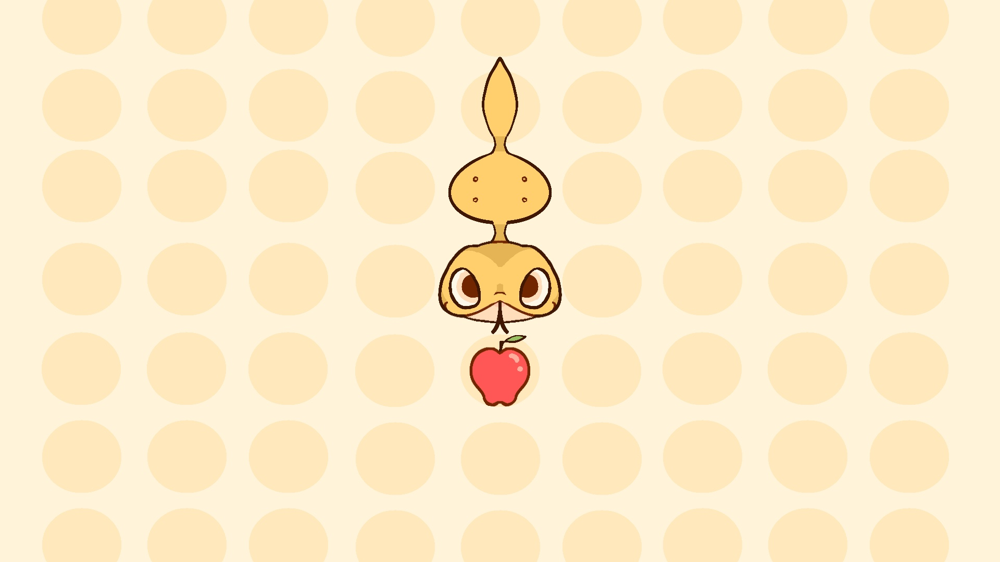
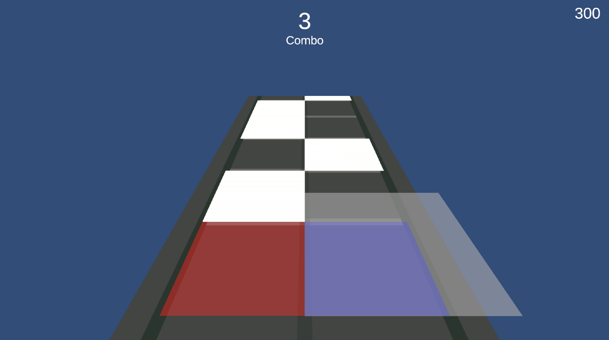

# Games For EEG
### Table of Contents
1. [Hide And Seek](#hide-and-seek)
2. [Fruit-Lover Snake](#fruit-lover-snake)
2. [Rhythm Game](#rhythm-game)
## Hide And Seek

- **Objective**: quickly catch the child character that briefly appears on the left or right side.
- **Controls**: Press **A** and __D__ to move left and right, respectively.
- **Gameplay**:
  - The player remains centered in the middle of the screen.
  - The child character will briefly appear on either the left or right side.
  - Quickly press the corresponding key (A for left, D for right) to catch the child character.
  - Timing and quick reactions are key to scoring points.

### Parameters
The above parameters can be adjusted to adapt to different situations.

__GameManager.cs__
|Variable Name|Description|
|-|-|
|Rest Interval|Rest time between each round in second|
|Appear Duration|How long is each round in seconds|

__PlayerCtrl.cs__
|Variable Name|Description|
|-|-|
|Walk Duration|How long will it take for the avatar to walk from the middle to the leftmost position (in seconds)|
|Correct Movement|True: player cannot move in the opposite direction. False: player can move in the opposite direction|

## Fruit-Lover Snake

- **Objective**: Control the snake to grow by eating fruit while avoiding collisions with itself.
- **Controls**: Use **A** and **D** to control the snake's movement (relative left and right).
- **Gameplay**:
  - The snake moves automatically.
  - Guide the snake to consume fruit that appears on the screen.
  - Each fruit consumed makes the snake longer.
  - Avoid the snake colliding with itself, or the game ends.

## Rhythm Game

- **Objective**: Score points by pressing the left or right input as notes reach the detection zone.
- **Controls**: Press **A** and __D__ for left and right, respectively.
- **Gameplay**:
  - Notes will fall in sync with the music.
  - When a note reaches the detection zone, press the corresponding input (A or D) to hit the note.
  - Score points based on timing and accuracy.
